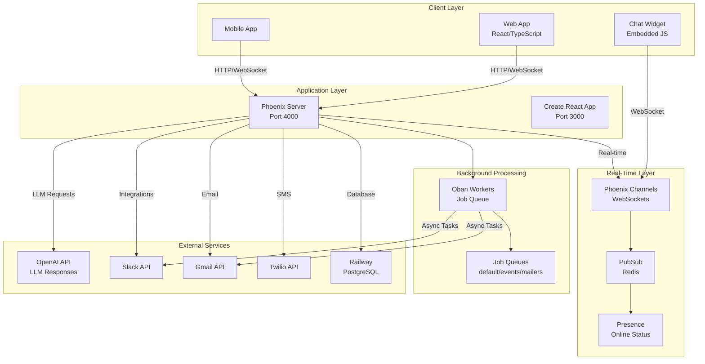
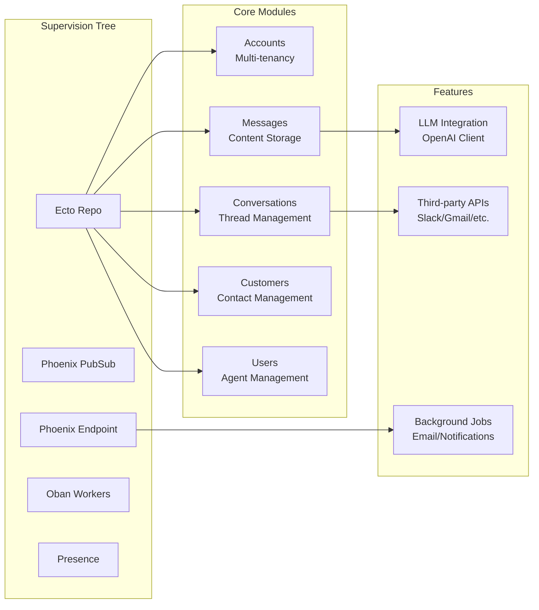
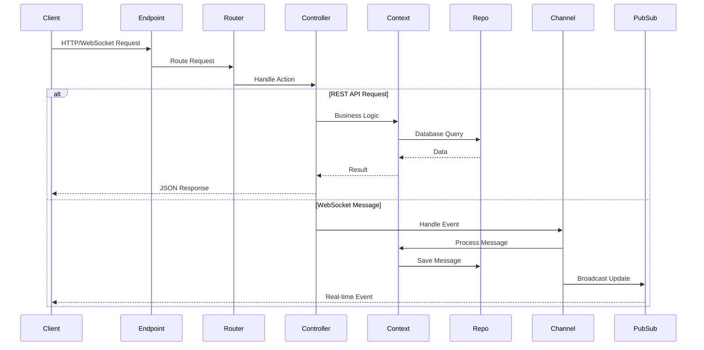
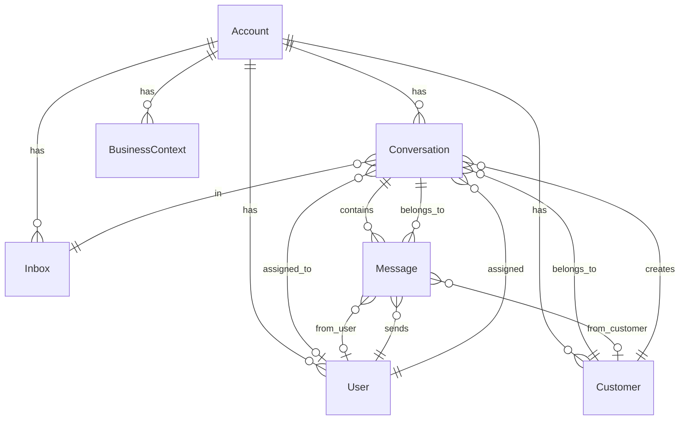
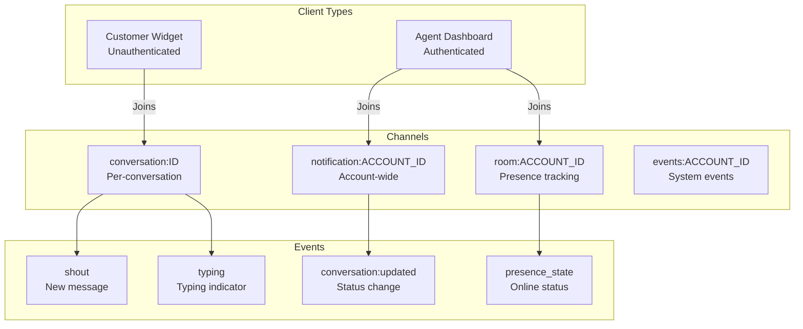
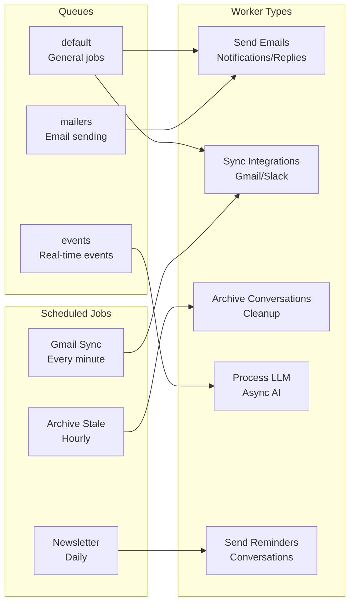
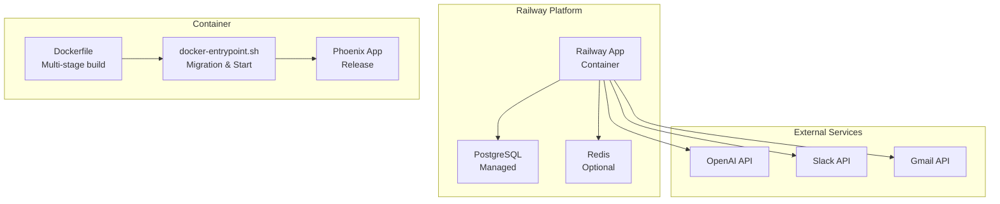

# System Architecture

## Overview

Netia is a real-time customer support platform built with **Elixir/Phoenix** (backend) and **React/TypeScript** (frontend). The system uses WebSockets for real-time messaging, integrates with LLMs for automated responses, and supports multiple communication channels.

## High-Level Architecture

## Application Structure

### Backend Components

### Request Flow

## Technology Stack

### Backend
- **Elixir 1.14.5** - Functional programming language
- **Erlang/OTP 24.3.4.13** - Fault-tolerant runtime
- **Phoenix** - Web framework with LiveView
- **Ecto** - Database wrapper and query builder
- **PostgreSQL** - Primary database (hosted on Railway)
- **Redis** - PubSub for distributed messaging (optional)

### Frontend
- **React** with **TypeScript** - UI framework
- **Create React App** - Build tooling
- **Phoenix Channels** - WebSocket client library
- **Phoenix LiveView** - Server-rendered React components

### Infrastructure
- **Railway** - Hosting and managed PostgreSQL
- **Docker** - Production containerization
- **Oban** - Background job processing
- **asdf** - Development tool version management

## Data Model

### Core Entities

### Key Relationships

- **Account**: Multi-tenant isolation (one account = one company)
- **User**: Agents/staff members who respond to conversations
- **Customer**: End-users who initiate conversations
- **Conversation**: Thread of messages between customer and agents
- **Message**: Individual message within a conversation
- **Inbox**: Routing channel (e.g., "General Support", "Sales")
- **BusinessContext**: LLM context for AI responses

## Real-Time Communication

### WebSocket Architecture

### Channel Topics

- `conversation:{conversation_id}` - Real-time updates for specific conversation
- `notification:{account_id}` - Account-wide notifications for agents
- `room:{account_id}` - Presence tracking (who's online)
- `events:{account_id}` - System events and webhooks
- `issue:{issue_id}` - Issue tracking updates

## Background Processing

### Oban Workers

### Common Workers

- **SendConversationReplyEmail** - Email notifications for unread messages
- **SyncGmailInboxes** - Sync Gmail conversations
- **SendPushNotifications** - Push notifications to agents
- **ProcessSesEvent** - Process AWS SES email events
- **ArchiveStaleClosedConversations** - Cleanup old conversations

## Deployment Architecture

### Production Setup

### Deployment Flow

1. **Git Push** → GitHub
2. **Railway** detects changes
3. **Docker Build** from `Dockerfile`:
   - Builds React frontend (`npm run build`)
   - Compiles Elixir/Phoenix (`mix release`)
   - Creates production release
4. **Container Start**:
   - Runs migrations (`db migrate`)
   - Starts Phoenix server (`run`)
5. **Live** - Application available

### Environment

- **Development**: Native Phoenix + CRA dev servers
- **Production**: Dockerized release on Railway
- **Database**: Railway managed PostgreSQL (dev & prod)

## Scalability Considerations

- **PubSub**: Redis-backed for multi-node deployment
- **Database**: PostgreSQL with connection pooling
- **Background Jobs**: Oban with queue-based processing
- **Real-time**: Phoenix Channels scale horizontally with Redis PubSub
- **LLM**: Async processing to avoid blocking requests
- **File Storage**: AWS S3 for uploaded files

