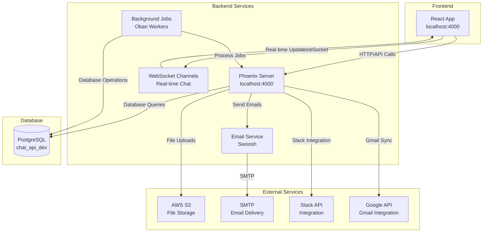

# Development Guide

## Install Docker

### macOS
```bash
# Install Docker Desktop
brew install --cask docker
# Or download from: https://www.docker.com/products/docker-desktop
```

### Ubuntu/Debian
```bash
# Install Docker
sudo apt-get update
sudo apt-get install docker.io docker-compose
sudo systemctl start docker
sudo usermod -aG docker $USER
# Log out and back in for group changes to take effect
```

### Verify Installation
```bash
docker --version
docker-compose --version
```

## Quick Start

```bash
# 1. Build and start all services (includes database)
./dev.sh start

# 2. Optional: Seed initial data
docker-compose exec papercups mix ecto.setup
```

That's it! The app will be running at:
- **Frontend & Backend**: http://localhost:4000
- **API**: http://localhost:4000/api/ping

## Development Workflow

**Important:** This setup uses a production-like environment for reliability. Code changes require rebuilding the container (~3 minutes) but ensure your local environment matches production exactly.

### Quick Commands (Recommended)
```bash
# Start development environment (first time or after code changes)
./dev.sh start

# After React changes (rebuilds container ~3 minutes)
./dev.sh react

# After Elixir/Phoenix changes (rebuilds container ~3 minutes)
./dev.sh backend

# Quick restart (no code changes, ~10 seconds)
./dev.sh restart

# After database changes
./dev.sh migrate

# View logs
./dev.sh logs

# Run tests
./dev.sh test

# Format code
./dev.sh format

# Clean up
./dev.sh clean
```

### Manual Docker Commands
```bash
# Start all services
docker-compose up

# Stop all services
docker-compose down

# Rebuild and start
docker-compose up --build

# View logs
docker-compose logs -f

# Access container shell
docker-compose exec papercups bash
```

## Database Operations
```bash
# Create the database
docker-compose exec papercups mix ecto.create

# Run all migrations
docker-compose exec papercups mix ecto.migrate

# Create database, run migrations, and seed data (all in one)
docker-compose exec papercups mix ecto.setup

# Drop the database
docker-compose exec papercups mix ecto.drop

# Reset database (drop, create, migrate, seed)
docker-compose exec papercups mix ecto.reset

# Rollback the last migration
docker-compose exec papercups mix ecto.rollback

# Open PostgreSQL console
docker-compose exec papercups mix ecto.console
```

## Environment Variables (Optional)

The Docker setup works with defaults, but you can create a `.env` file to customize:

```bash
# Database (Docker handles this automatically)
DATABASE_URL=ecto://postgres:postgres@db/postgres

# Security (generate your own)
SECRET_KEY_BASE=3sBDZCKsYWQ2NEAW2hw9GIFEvxywgHxEvuCQ2u65zvdAoCV4EGBH00ho8NqDjeGob9Z5msNiFLBYe745obd6Vw==

# Application URLs
BACKEND_URL=localhost:4000
REACT_APP_URL=localhost:4000

# Multi-tenant mode
MULTI_TENANT_MODE=true
```

**Note:** The Docker setup includes a PostgreSQL database automatically - no local database installation needed!

## Verification

Check if everything is working:

```bash
# Check container status
docker-compose ps

# Test backend API
curl http://localhost:4000/api/ping

# Test frontend
curl http://localhost:4000

# View logs
docker-compose logs -f
```

## Troubleshooting

**Docker issues:**
```bash
# Restart everything
docker-compose down
docker-compose up --build

# Check container status
docker-compose ps

# View specific logs
docker-compose logs papercups
docker-compose logs db
```

**Database issues:**
```bash
# Reset database
docker-compose exec papercups mix ecto.reset

# Check database connection
docker-compose exec papercups mix ecto.console
```

**Port conflicts:**
```bash
# Check what's using ports
lsof -i :4000
lsof -i :3000
lsof -i :5432

# Stop conflicting services
docker-compose down
```

## Production Deployment

### Railway Configuration
- **Uses main `Dockerfile`** for production builds
- **Ignores development files** (`docker-compose.yml`, `dev.sh`, etc.)
- **Uses Railway environment variables** from dashboard
- **Auto-deploys** when you push to GitHub

### Safe to Push
- ✅ All development files (`dev.sh`, `docker-compose.yml`, `development.md`)
- ✅ Application code changes (`lib/`, `assets/`, `priv/`, `config/`)
- ✅ Documentation and scripts

### Development vs Production
- **Local Development**: Uses `docker-compose.yml` with persistent database
- **Production**: Uses Railway with `Dockerfile` and Railway's database
- **Code Changes**: Require container rebuild (~3 minutes) for reliability
- **Database**: Persists between restarts and rebuilds

### Deployment Flow
```
Local Development → Git Push → Railway Auto-Deploy → Production
     ↓                    ↓              ↓              ↓
  ./dev.sh start    git push origin   Railway builds   Live site
  (rebuilds ~3min)     main           from Dockerfile   updates
```

## Architecture Overview



## How Chat Widgets Work

When customers add chat widgets to their websites, here's what happens:

### 1. Widget Installation
Customers get HTML code like this:
```html
<script>
window.Papercups = {
  config: {
    token: "account-id-here",
    title: "Welcome!",
    primaryColor: "#1890ff",
    baseUrl: "https://your-papercups-domain.com"
  }
};
</script>
<script src="https://your-papercups-domain.com/widget.js"></script>
```

### 2. Widget Loading Process
1. **Customer's website** loads the widget script from your Papercups server
2. **Widget script** (`widget.js`) is served from `/priv/static/widget.js` 
3. **Widget connects** to your Phoenix backend via WebSocket
4. **Real-time chat** begins between customer and your support team

### 3. Widget Build Process
```bash
# Frontend build copies widget.js to backend
cd assets && npm run build
# This runs: cpx "./build/**" "../priv/static" --clean
```

### 4. Widget Configuration
- **Account ID**: Links widget to specific Papercups account
- **Inbox ID**: Routes messages to specific support team
- **Customization**: Colors, messages, availability settings
- **Customer Data**: Optional user identification

### 5. Multi-Tenant Integration
For Netia's multi-tenant setup:
- Each tenant gets their own account/inbox
- Widgets automatically route to correct support team
- Webhooks notify your main API of new messages

## Background Jobs (Oban Workers)

The system runs several background jobs to handle various tasks:

### Scheduled Jobs (Cron)
```bash
# Every hour
- ArchiveStaleClosedConversations: Archives conversations closed >14 days
- Example: Basic example worker

# Every minute  
- SyncGmailInboxes: Syncs Gmail messages for email support

# Every 30 minutes
- SendAllConversationReminders: Sends conversation reminder emails

# Daily at 2pm UTC
- SendPgNewsletter: Sends daily newsletter
```

### Email Jobs
- **SendConversationReplyEmail**: Sends email notifications when customers reply
- **SendWelcomeEmail**: Sends welcome emails to new users
- **SendUserInvitationEmail**: Sends invitation emails to team members

### Notification Jobs
- **SendPushNotifications**: Sends mobile push notifications via Expo
- **SendMentionNotification**: Notifies users when mentioned in conversations
- **SendGmailNotification**: Sends Gmail notifications

### Data Sync Jobs
- **SyncGmailInbox**: Syncs individual Gmail inboxes with Papercups
- **ProcessSesEvent**: Processes AWS SES email events
- **SaveBrowserReplayEvent**: Saves browser session recordings

### Queue Configuration
- **default**: 10 concurrent jobs (general tasks)
- **events**: 50 concurrent jobs (high-volume events)
- **mailers**: 20 concurrent jobs (email sending)