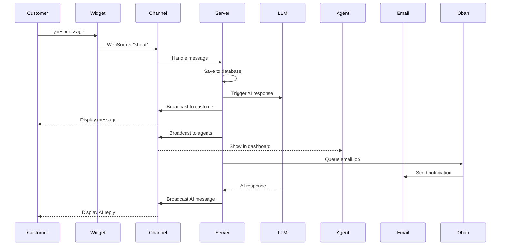
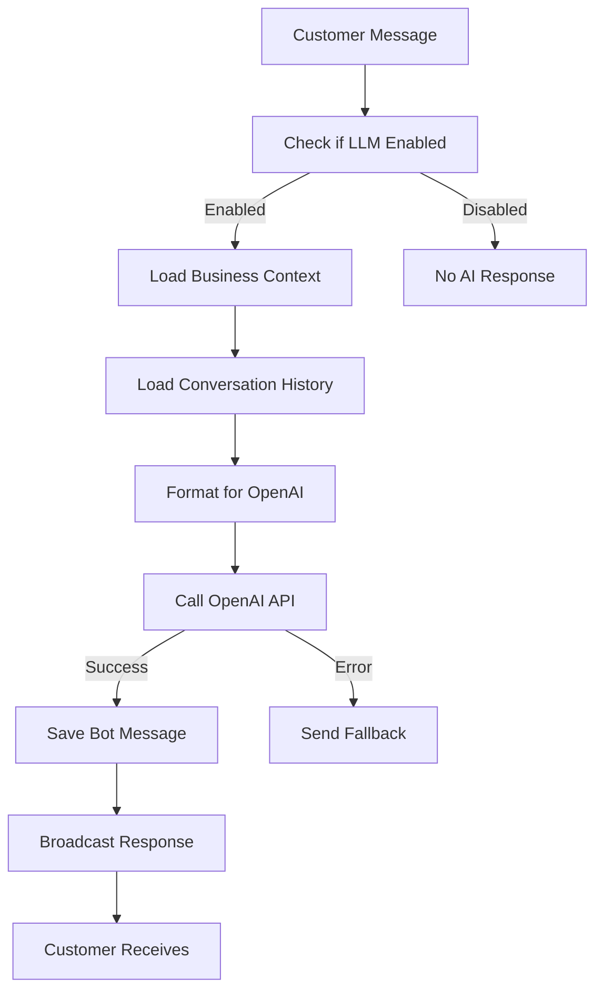
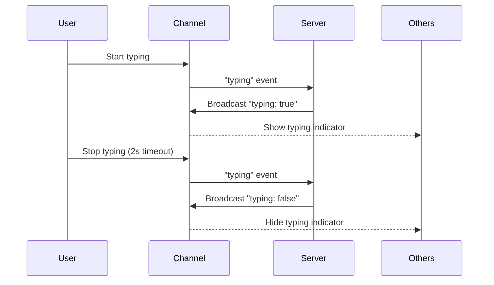
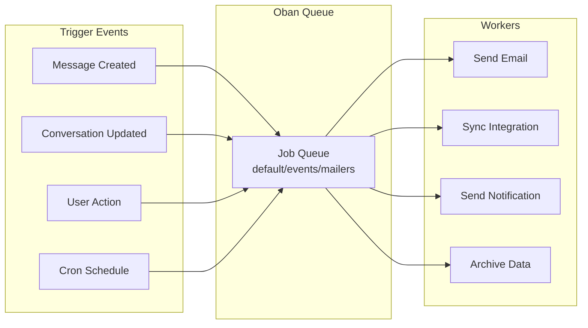
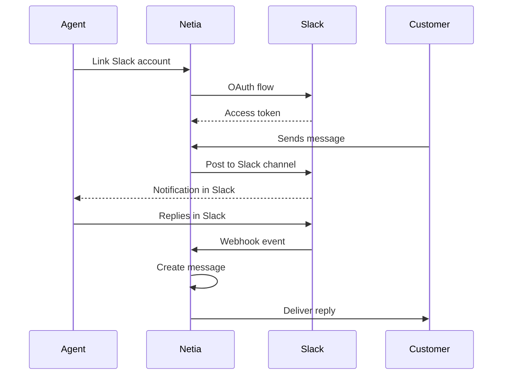
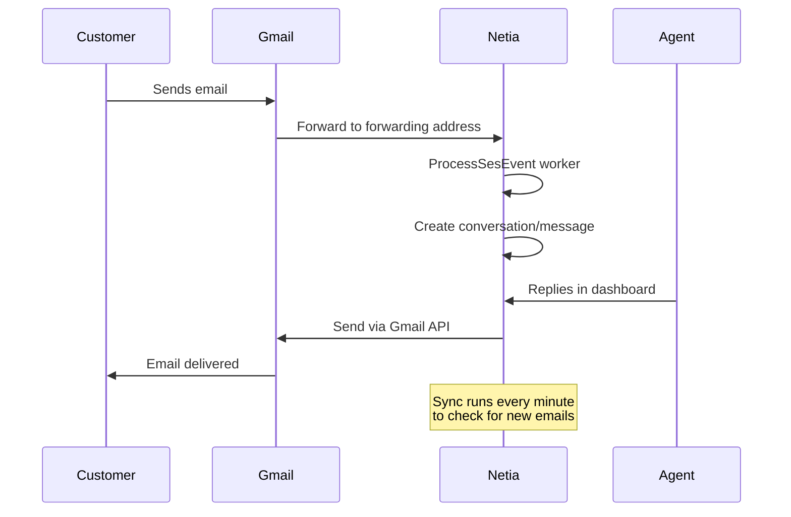
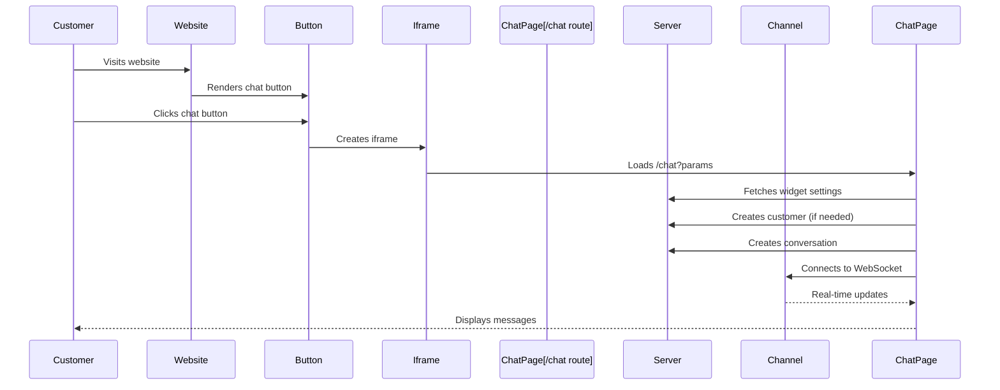
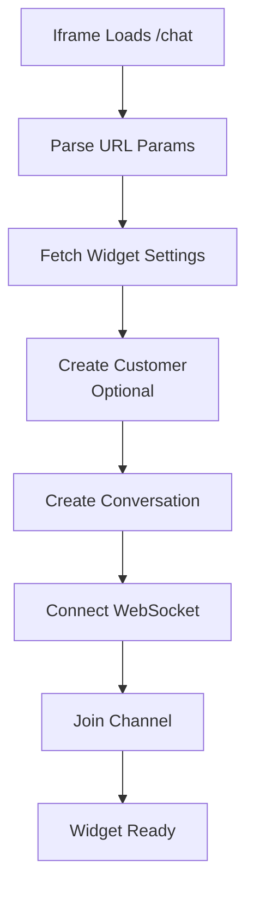
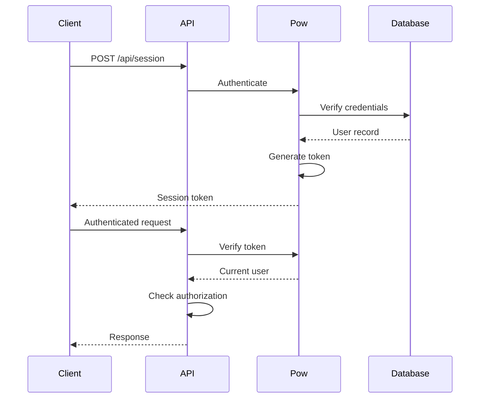
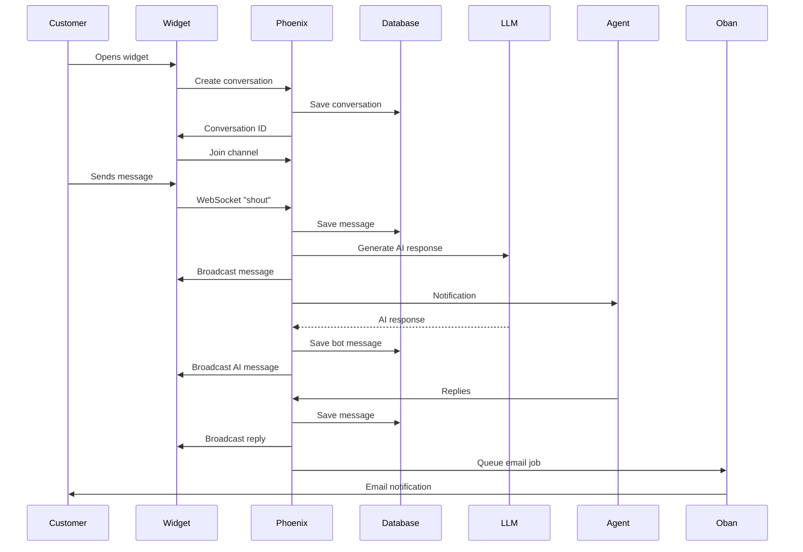

# Core Features & Workflows

## Messaging System

### Message Flow



### Message Types

- **Customer Message**: From end-user (source: `"chat"`)
- **Agent Message**: From staff member (source: `"chat"`, has `user_id`)
- **Bot Message**: LLM-generated (source: `"chat"`, type: `"bot"`)
- **Email Message**: From email integration (source: `"email"`)
- **Slack Message**: From Slack integration (source: `"slack"`)

### Conversation States

- **Open**: Active conversation requiring response
- **Closed**: Resolved conversation
- **Snoozed**: Temporarily hidden
- **Priority**: Marked as high priority

## LLM Integration

### AI Response Generation



### LLM Implementation

**Location**: `lib/chat_api/llm/`

**Key Components**:
- `ResponseHandler` - Orchestrates LLM response workflow
- `OpenAIClient` - API communication with OpenAI

**Workflow**:
1. Customer sends message
2. `ResponseHandler.handle_customer_message/2` triggered
3. Loads conversation history (last N messages)
4. Loads business context (company info, instructions)
5. Formats prompt with system instructions + history
6. Calls OpenAI API (default: `gpt-4o-mini`)
7. Creates bot message with response
8. Broadcasts to conversation channel

**Configuration**:
- Model: `LLM_MODEL` env var (default: `gpt-4o-mini`)
- Max tokens: `LLM_MAX_TOKENS` (default: 500)
- Temperature: `LLM_TEMPERATURE` (default: 0.7)
- Timeout: `LLM_TIMEOUT` (default: 30 seconds)
- Retries: `LLM_MAX_RETRIES` (default: 2)

**Business Context**:
Stored in `business_contexts` table:
- `business_name` - Company name
- `business_description` - Company info
- `instructions` - Custom AI instructions
- `scheduling_link` - Link for scheduling

## Real-Time Communication

### WebSocket Channels

**Customer Widget**:
```javascript
// Connects to conversation channel
socket.channel(`conversation:${conversationId}`, { customer_id })
```

**Agent Dashboard**:
```javascript
// Multiple channels for different purposes
socket.channel(`notification:${accountId}`)  // New messages
socket.channel(`room:${accountId}`)          // Presence
socket.channel(`events:${accountId}`)         // System events
```

### Presence System

Tracks online/offline status:
- Agents: Tracked in `room:{account_id}` channel
- Customers: Tracked in `conversation:{id}` channel
- Updates: `presence_state` and `presence_diff` events

### Typing Indicators



## Background Jobs

### Job Processing



### Common Job Patterns

**Email Notifications**:
```elixir
# Triggered when agent replies to customer
Oban.insert(%{
  worker: "ChatApi.Workers.SendConversationReplyEmail",
  args: %{message: message}
})
```

**Integration Sync**:
```elixir
# Scheduled every minute
Oban.insert(%{
  worker: "ChatApi.Workers.SyncGmailInbox",
  args: %{account_id: account_id, authorization_id: auth_id}
})
```

**Archival**:
```elixir
# Scheduled hourly
{"0 * * * *", ChatApi.Workers.ArchiveStaleClosedConversations}
```

## Integration Workflows

### Slack Integration



**Features**:
- Two-way sync: Netia ↔ Slack
- Channel mapping: Netia inbox ↔ Slack channel
- Thread support: Replies stay in threads
- Rich formatting: Markdown support

### Gmail Integration



**Features**:
- Email forwarding: Receive emails as conversations
- Send replies: Agent replies sent via Gmail API
- Inbox sync: Periodic sync for new emails
- Thread tracking: Maintains conversation context

### Twilio (SMS) Integration

**Flow**:
1. Customer sends SMS to Twilio number
2. Twilio webhook → Netia creates conversation
3. Agent replies in dashboard
4. Netia sends SMS via Twilio API
5. Customer receives SMS

## Customer Widget

### How the Widget Works

The chat widget uses the **`/chat`** route, which serves a standalone HTML page that loads in an iframe. Here's how it works:



### Widget Architecture

**Embed Code**:
```html
<!-- Chat button on customer website -->
<div id="netia-chat-widget">
  <button id="netia-chat-button">💬</button>
</div>

<script>
(function() {
  const button = document.getElementById('netia-chat-button');
  let iframe = null;
  
  button.addEventListener('click', function() {
    if (!iframe) {
      // Create iframe pointing to /chat route
      iframe = document.createElement('iframe');
      iframe.src = 'https://app.netia.io/chat?token=ACCOUNT_ID&inbox=INBOX_ID';
      iframe.style.cssText = '...';
      document.body.appendChild(iframe);
    }
  });
})();
</script>
```

**Chat Page (`/chat` route)**:
- Served by `WidgetController.chat/2`
- Renders standalone HTML page with embedded JavaScript
- Uses Phoenix Channels for WebSocket communication
- Loads Phoenix.js from CDN
- Configurable via URL query parameters

### Widget Lifecycle



### Features

- **Standalone Page**: Full HTML page served at `/chat` route
- **Iframe Embed**: Embedded in customer website via iframe
- **Auto-Connection**: Automatically creates customer and conversation
- **Real-time Updates**: Uses Phoenix Channels for WebSocket communication
- **Typing Indicators**: Shows AI typing indicator
- **LLM Integration**: Automatically triggers AI responses
- **Customizable**: Configurable via URL parameters

### Configuration (URL Parameters)

**Required**:
- `token` or `accountId` - Account identifier

**Optional**:
- `inbox` - Inbox ID for routing
- `title` - Widget title
- `subtitle` - Widget subtitle
- `primaryColor` - Primary color (hex)
- `greeting` - Initial greeting message
- `newMessagePlaceholder` - Input placeholder text
- `showAgentAvailability` - Show agent availability (1 or 0)
- `isBrandingHidden` - Hide branding (true/false)
- `companyName` - Company name for branding
- `baseUrl` - API base URL

### Example URL

```
/chat?token=ACCOUNT_ID
&inbox=INBOX_ID
&title=Support Chat
&subtitle=We're here to help
&primaryColor=#1677ff
&greeting=Hello! How can I help you?
&showAgentAvailability=1
&isBrandingHidden=false
```

### Technical Details

**Route**:
```elixir
# Router configuration
scope "/", ChatApiWeb do
  pipe_through(:widget)  # No X-Frame-Options header
  
  get("/chat", WidgetController, :chat)
end
```

**Controller**:
```elixir
defmodule ChatApiWeb.WidgetController do
  def chat(conn, _params) do
    html(conn, chat_html())  # Renders inline HTML
  end
end
```

**WebSocket Connection**:
- Connects to `/socket` endpoint
- Joins `conversation:{conversation_id}` channel
- Sends messages via `shout` event
- Receives messages via `shout` event
- Typing indicators via `typing` event

### Widget Flow

1. **Customer clicks chat button** → Iframe created
2. **Iframe loads `/chat`** → Widget page rendered
3. **Widget creates customer** (if needed) via `POST /api/customers`
4. **Widget creates conversation** via `POST /api/conversations`
5. **Widget connects to WebSocket** → Joins conversation channel
6. **Customer sends message** → WebSocket `shout` event
7. **Server broadcasts** → All connected clients receive update
8. **AI response triggered** → LLM generates response
9. **AI message broadcast** → Customer receives AI reply

## Authentication & Authorization

### Authentication Flow



**Authentication**:
- **Pow** - Authentication library
- Token-based sessions
- API tokens via `PersonalApiKey`

**Authorization**:
- Account-based isolation
- Role-based access (admin/member/viewer)
- Resource-level permissions

### API Authentication

**Public Endpoints**:
- Widget endpoints (customer-facing)
- Webhook endpoints (Slack/Twilio/etc.)
- Registration/Login

**Protected Endpoints**:
- Agent dashboard endpoints
- Require authentication token
- Check user permissions

## Data Flow Example

### Complete Customer Interaction



